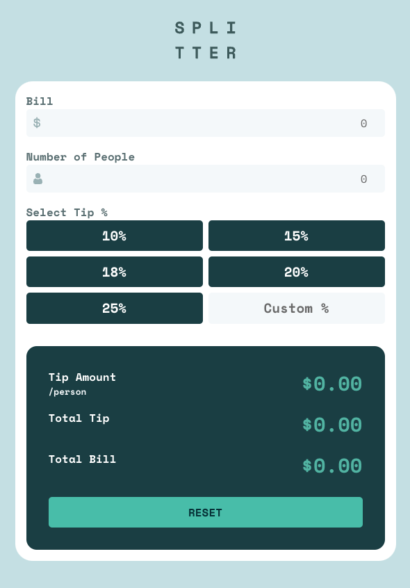

# Frontend Mentor - Tip calculator app solution

This is a solution to the [Tip calculator app challenge on Frontend Mentor](https://www.frontendmentor.io/challenges/tip-calculator-app-ugJNGbJUX). Frontend Mentor challenges help you improve your coding skills by building realistic projects.

## Table of contents

- [Overview](#overview)
  - [The challenge](#the-challenge)
  - [Screenshot](#screenshot)
  - [Links](#links)
- [My process](#my-process)
  - [Built with](#built-with)
  - [What I learned](#what-i-learned)
  - [Continued development](#continued-development)
- [Author](#author)

## Overview

### The challenge

Users should be able to:

- View the optimal layout for the app depending on their device's screen size
- See hover states for all interactive elements on the page
- Calculate the correct tip and total cost of the bill per person

### Screenshot



### Links

- [Solution URL](https://github.com/codercreative/tip-calculator-app)
- [Live Site URL](https://tip-calculator-chris.netlify.app/)

## My process

### Built with

- Semantic HTML5 markup
- CSS custom properties
- Flexbox
- CSS Grid
- Mobile-first workflow

### What I learned

**Overall comment about UI/UX:**

- **Input Order**

  - I adjusted the input field order in order to create a smoother user experience. Now, users are guided through this sequence:
    - Enter the bill amount
    - Enter the number of people
    - Select the tip percentages

- **Tip Percentages**

  - I modified the fixed tip amounts to reflect percentages that users might more commonly choose. For example, the original design included a 50% tip, which I adjusted to a more typical range.

- **Result Labels**

  - I updated the result labels to provide clearer information. The new labels show Tip Amount/person, Total Tip, and Total Bill (instead of Tip Amount/person and Total/person), which I found to be more intuitive for users.

**Enhancing Accessibility:**

I added the `fieldset` element and used the `aria-labelledby` attribute to group related form elements together for improved accessibility. This ensures that screen readers can properly associate the "Bill" and "Number of People" labels with the corresponding inputs, making it easier for visually impaired users to navigate the form.

```html
<fieldset aria-labelledby="bill-label people-label">
  <label for="bill-input" id="bill-label" class="bill-label"
    >Bill
    <span
      class="bill-error-msg"
      id="bill-error-msg"
      aria-live="assertive"
    ></span
  ></label>
  <input
    id="bill-input"
    class="bill-input"
    name="bill"
    type="number"
    placeholder="0"
  />

  <label for="number-of-people" id="people-label" class="people-label">
    Number of People
    <span
      id="people-error-msg"
      class="people-error-msg"
      aria-live="assertive"
    ></span>
  </label>
  <input
    id="number-of-people"
    class="people-input"
    name="people"
    type="number"
    placeholder="0"
  />
</fieldset>
```

In connection with the `fieldset` elements, I also used a `legend` tag to provide a clear label for the group of tip percentage buttons. This allows screen readers to understand the context of the buttons, improving accessibility for all users.

```html
<fieldset>
  <legend>Select Tip %</legend>
  <div class="tip-percent-container">
    <button class="tip-btn" data-percent="0.10" aria-label="10 percent tip">
      10%
    </button>
  </div>
</fieldset>
```

Making sure to add aria-labels (e.g., `aria-label="10 percent tip"`) to my tip buttons for greater accessibility:

```html
<div class="tip-percent-container">
  <button class="tip-btn" data-percent="0.10" aria-label="10 percent tip">
    10%
  </button>
</div>
```

Using aria-live="assertive" for accessibility to ensure that error messages are immediately announced by screen readers, helping users with visual impairments receive critical information without delay.

```html
<label for="bill-input" class="bill-label"
  >Bill
  <span class="bill-error-msg" id="bill-error-msg" aria-live="assertive"></span
></label>
```

Making sure that there is enough contrast for text with `filter: contrast(120%)`:

```css
.reset-btn {
  width: 100%;
  text-transform: uppercase;
  background: var(--strong-cyan);
  font-weight: 700;
  color: var(--very-dark-cyan);
  /*Ensure enough contrast */
  filter: contrast(120%);
  border-radius: 5px;
  padding: 0.5em 0;
  border: none;
  margin-top: 0.5em;
  cursor: pointer;
  border: 2px solid transparent;
  transition: all 0.3s ease;
}
```

**Other Notes:**

How I resolved inserting the dollar and person icons:

```css
.bill-input,
.people-input {
  background: var(--very-light-greyish-cyan);
  border: none;
  border-radius: 5px;
  width: 100%;
  padding: 0.5em 0;
  color: var(--greyish-cyan);
  margin-bottom: 1em;
  background-repeat: no-repeat;
  /* center the icon and the dollar amount on the same line */
  background-position: 10px center;
  /* Number 0 right-aligned */
  text-align: right;
}

.bill-input {
  background-image: url("images/icon-dollar.svg");
}

.people-input {
  background-image: url("images/icon-person.svg");
```

Auto-hiding placeholder text upon focus in input fields:

```css
.bill-input:focus::placeholder,
.people-input:focus::placeholder,
.custom-tip-btn:focus::placeholder {
  color: transparent;
}
```

Right-align the error messages to the label titles:

```css
/* Right-align the error messages to the label titles */
.bill-label,
.people-label {
  display: flex;
  justify-content: space-between;
}
```

Since the custom tip button is an input field and not a button, I had to make sure that the input field and the tip buttons would be the same width across all devices. Thankfully, it was a simple solution: I just added a `width: 100%`:

```css
.tip-btn,
.custom-tip-btn {
  background-color: var(--very-dark-cyan);
  color: var(--white);
  font-size: 1.2rem;
  font-weight: 700;
  padding: 0.3em 0;
  border-radius: 5px;
  cursor: pointer;
  border: 2px solid transparent;
  transition: all 0.3s ease;
  /* Make tip buttons and custom-tip-btn the same width across all devices */
  width: 100%;
}
```

Remember to include Number() in front of tip in the second line because `tip.toFixed(2)` returns a string.

```js
 //Calculate tip and total
  const tip = (billAmount * tipPercentage).toFixed(2);
  const total = (billAmount + Number(tip)).toFixed(2);
  const tipPerPersonAmount = (tip / people).toFixed(2);
};
```

### Continued development

- Refactor the code to make it more DRY.
- Create an error message if the custom tip is too high.
- It would also be fun to make some motion design on the custom tip input field for greater user experience

## Author

- [Frontend Mentor](https://www.frontendmentor.io/profile/codercreative)
